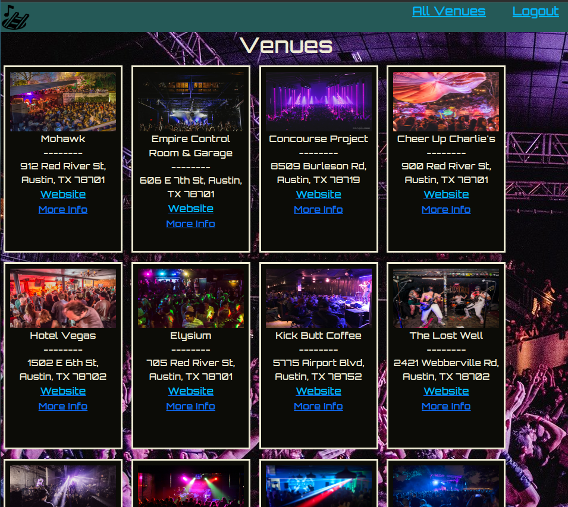

# Austin Music Underground

#### Austin Music Underground exists to bring attention to music spaces in Austin that cater to bands and fans with musical tastes that deviate from the norm

### Getting Started:
Website link: 

### How to use the site:

1. AAU I want to be able to login using Google OAuth 

2. AAU I want to be able click on the "All Venues" link to see a collection of music venues & information in card form

3. AAU I want to be able to visit the venues' websites to see the current schedules
   
4. AAU I want to be able to click "More Info" to visit a landing page for each venue that allows me to review and rate them.
   
5. AAU I want to be able to delete reviews I make, but only ones tied to my individual profile

6. AAU I want to be able to see what other visitors to the site have said in their reviews
   
7. AAA I want to be able to delete any reviews off the site at will

### Technologies used: 
Node.js, Express, Mongoose, MongoDB, JavaScript, HTML, CSS

### Iceboxes: 
1. AAU I want to be able to click a button within the Venue details view to google map to the location
2. AAU I want users to be able to add venues they've been to that aren't in the system, with the card to be populated with a stock image
3. AAU that has attended a venue, I should be able to view the venues I've visited in my profile page
4. AAU, I should be able to go to a page and see a list of profiles from every user that has created an account on the site.